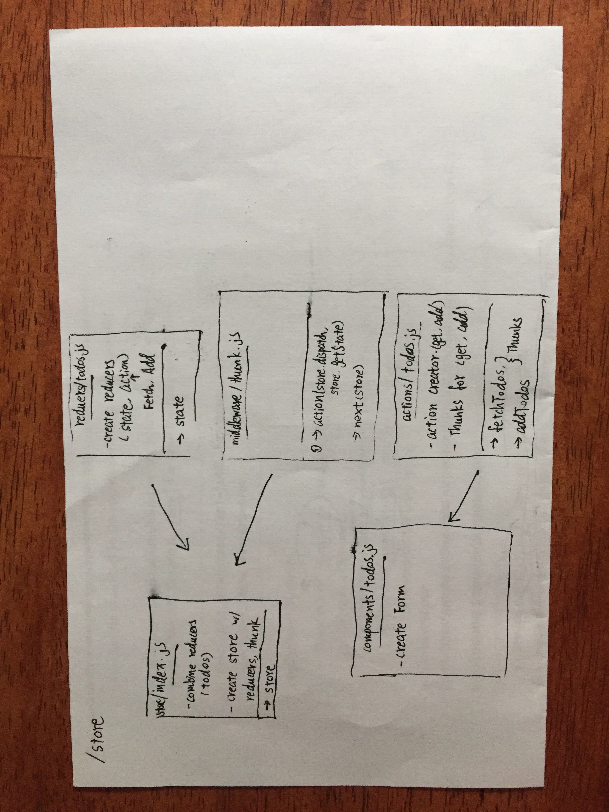

# travel-buddy

## React redux

### Author: Leyi Li

### Links and Resources
* [submission PR](https://github.com/401-advanced-javascript-leyla/travel-buddy)
* [heroku](https://travel-buddy-leyla.herokuapp.com/)

### Components
#### `login`
The Login component is checking users information
#### `dayForm`
The deyForm component creates the form to delete/update the data

### Setup

#### Running the app
* `npm install`
* `npm start`

## Available Scripts

In the project directory, you can run:

### `npm start`

Runs the app in the development mode. 
Open [http://localhost:3000](http://localhost:3000) to view it in the browser.

The page will reload if you make edits. 
You will also see any lint errors in the console.

### `npm test`

Launches the test runner in the interactive watch mode. 
See the section about [running tests](https://facebook.github.io/create-react-app/docs/running-tests) for more information.

### documentation
`npm docs`

### UML

